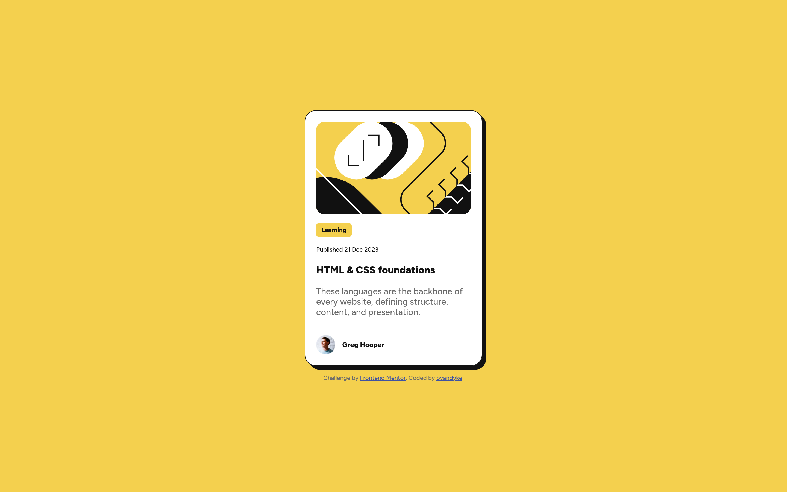

# Frontend Mentor - Blog preview card solution

This is a solution to the [Blog preview card challenge on Frontend Mentor](https://www.frontendmentor.io/challenges/blog-preview-card-ckPaj01IcS). Frontend Mentor challenges help you improve your coding skills by building realistic projects. 

## Table of contents

- [Overview](#overview)
  - [The challenge](#the-challenge)
  - [Screenshot](#screenshot)
  - [Links](#links)
- [My process](#my-process)
  - [Built with](#built-with)
  - [What I learned](#what-i-learned)
  - [Continued development](#continued-development)
  - [Useful resources](#useful-resources)
- [Author](#author)
- [Acknowledgments](#acknowledgments)

**Note: Delete this note and update the table of contents based on what sections you keep.**

## Overview

### The challenge

Users should be able to:

- See hover and focus states for all interactive elements on the page

### Screenshot

### Links

- Solution URL: [Add solution URL here](https://your-solution-url.com)
- Live Site URL: [Add live site URL here](https://your-live-site-url.com)

## My process

### Built with

- Semantic HTML5 markup
- CSS custom properties
- Flexbox
- Mobile-first workflow

### What I learned

* Learned more about variant fonts. How they work and how to use them.
* Used @layer in CSS to organize the code.
* Modular CSS for the card component. I learned more about encapsulating CSS in a 
way that makes it easy to reuse.

### Continued development

Continue gathering feedback from the mods at FEM and keep building! Next, I intend to finish the beginner path and move on to full pages, then sites.

### Useful resources

- [MDN: font-variation-settings](https://developer.mozilla.org/en-US/docs/Web/CSS/font-variation-settings) - Helped a bit with the variable fonts. Still need to dive deeper.
- [CSS In Depth](https://www.manning.com/books/css-in-depth) - Great book I've been using to help me learn CSS. Covers a ton of modern practices that helped update my skills. 

## Author

- Website - [Brett Vandyke](https://github.com/ridge-runner/)
- Frontend Mentor - [@bvandyke](https://www.frontendmentor.io/profile/bvandyke)

## Acknowledgments

The mods tirelessly reviewing code in the FEM Discord and the writers who maintain MDN.
